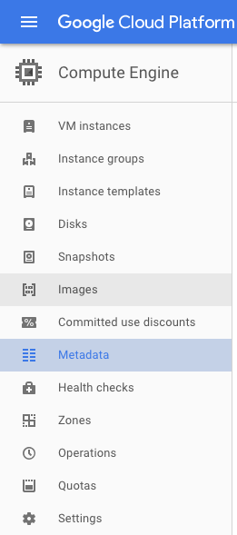

# Full documentation for deployment

To use VizIT in an edX course at your institution, you need two things:

* A server to store the course data and serve the Shiny dashboard.
* Staff access to the course in the edX website, so that you can insert an iFrame that shows the dashboard from within the HTML for a course element.

At UBC, the dashboard is hosted on a virtual machine (VM) instance in [Google Compute Engine](https://console.cloud.google.com/compute/). If you wish to do the same, you will need to configure a [service account](https://cloud.google.com/compute/docs/access/service-accounts), since the VizIT application — which will be running on a VM instance — will need to identify itself to Google Cloud and Google BigQuery.

Once you have configured a service account, make sure you have authorization to create and manage VM instances for your project. At minimum, you will probably need the `roles/iam.serviceAccountActor` role and the `roles/compute.instanceAdmin.v1` role.

Once you have authorization, you should be able to add an SSH key to your project metadata.



Go to `SSH keys`, then click `Edit`, then paste your public SSH key into the text box, and click `Save`.

Now, if you go to VM instances, you should be able to access any running instance through SSH.

You will now have to create an instance. Depending on your location and how many dashboards you wish to set up, you may choose different settings. Currently, our machine type is `n1-standard-2 (2 vCPUs, 7.5 GB memory)`.

Once you have created an instance, you will need to connect to it. To do this, click the arrow next to "SSH" under the "Connect" heading, and select your preferred method. The easiest way to connect to your instance through the command line is using gcloud commands, so click "View gcloud command." You can either copy-paste the command into your own shell, or you can run it in the cloud shell console.

You may need to install Gcloud Toolkit in order to access your instance from Terminal. To do this, use the following command:

```
curl https://sdk.cloud.google.com | bash
```

When shown the following prompt:

```
Modify profile to update your $PATH and enable bash completion? (Y/n)
```

Answer `Y`. Then restart Terminal. You should now be able to SSH into your VM instance using the gcloud command that you copy-pasted from the instances page.

